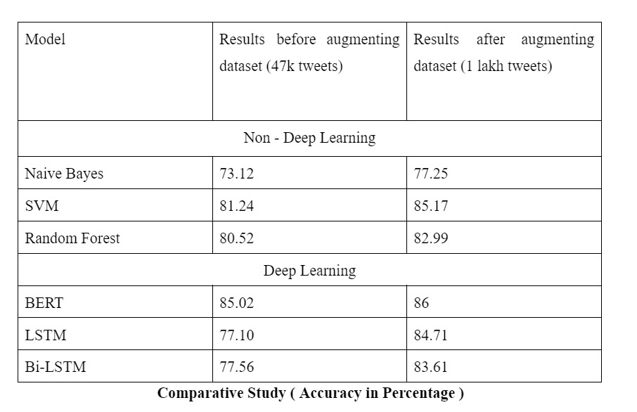

# Cyberbullying-Detection

The project, titled "Detecting Cyberbullying using Deep Learning", aims to investigate cyber aggression on Twitter, focusing on identifying derogatory tweets based on gender, race, or sexual orientation. It seeks to develop an automated system capable of accurately analyzing text-based content across online platforms to detect instances of cyberbullying. 

Leveraging a dataset of approximately 110,000 instances, the study explores various detection methods, including non-deep learning approaches such as SVM, L2 regularization, random forest, and deep learning techniques utilizing BERT. Additionally, an ensemble learning approach combining BERT and LSTM is planned. 

The classification system categorizes tweets into six major categories: gender, age, religion, not cyberbullying, and ethnicity. To evaluate the effectiveness of these methods, a test dataset of 20,000 tweets will be employed, facilitating a comparative analysis to determine which model best identifies and classifies cyberbullying tweets accurately.

Final Year Project - Developed by Subrato Tapaswi, Prasad Jawale, Anushka Kulkarni and Lakshman Bhojwani

